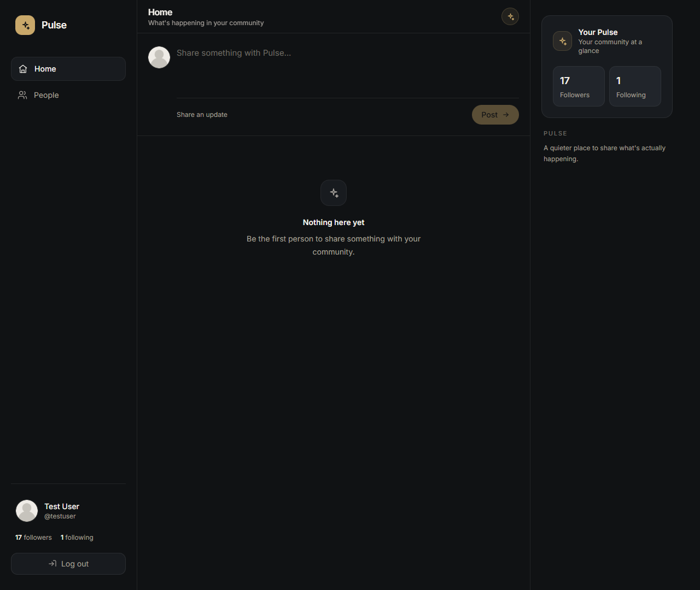
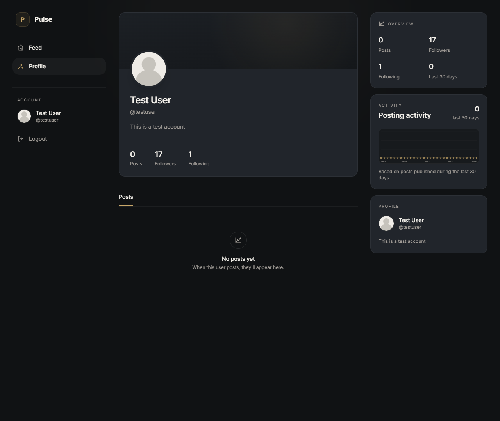
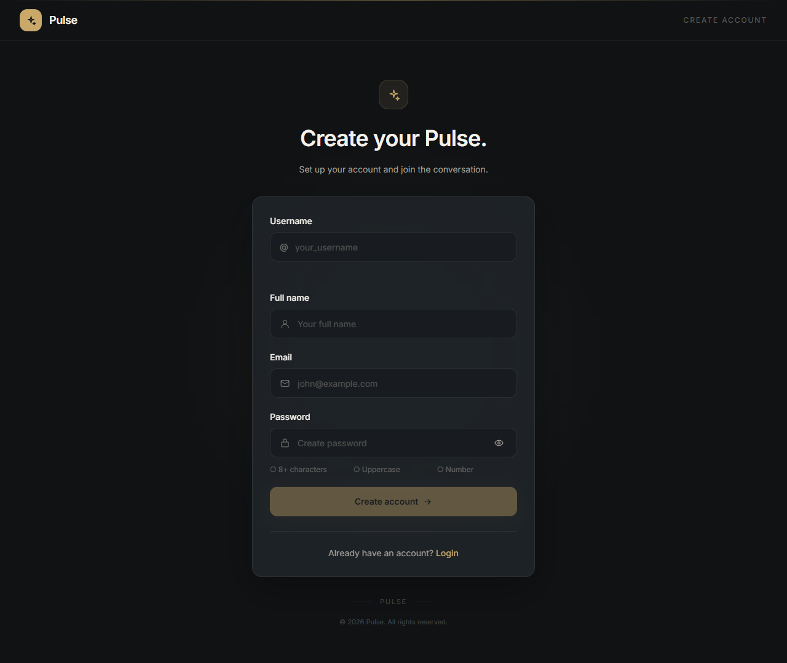

# Pulse


**Simple by design. Built to connect.**

Pulse is a lightweight full-stack social platform — authentication, profiles, posts, likes, follows, search, and role-based permissions, built end to end rather than mocked on top of a frontend template.

It started as a university project. The goal wasn't a pretty UI over fake JSON — it was learning how a real application fits together: a relational schema, a REST API, session auth, and a React frontend that actually talks to all of it.

---

## A Look at Pulse

### Feed



A focused timeline for posts from the people you follow — nothing else competing for attention.

### Profile



Activity, followers, following, and posts in one place.

### Create an Account



Registration with live username availability checks and clear password requirements.

---

## Why This Project Exists

Pulse was built to go deeper than a frontend-only portfolio piece. It's a full stack, deliberately:

- Designing and consuming a REST-style API
- Modeling relational data in MySQL — foreign keys, indexes, constraints
- Implementing session-based authentication with HTTP-only cookies
- Connecting a React frontend to a PHP backend over a real network boundary
- Enforcing authorization rules for users vs. administrators
- Verifying behavior with automated smoke tests, not just manual clicking

## Features

- User registration and login with HTTP-only session cookies
- Username validation and availability checks
- Post creation and feed display
- Like / unlike
- Editable user profiles
- Follow / unfollow
- User search
- Role-based permissions, including admin post deletion and moderation
- Responsive React frontend
- PHP API smoke tests and syntax validation in CI-style scripts

## Tech Stack

| Area        | Technologies                                 |
| ----------- | -------------------------------------------- |
| Frontend    | React, React Router, Vite, Tailwind CSS      |
| Backend     | PHP, PDO, REST-style API, PHP sessions       |
| Database    | MySQL, InnoDB, foreign keys, indexed queries |
| Development | XAMPP, Node.js, npm, cURL                    |

## Project Structure

```text
Pulse/
├── backend/
│   ├── config/           Database configuration
│   ├── controllers/      Request and business logic
│   ├── middleware/       Authentication middleware
│   ├── models/           Database access models
│   ├── public/uploads/   User-uploaded profile assets
│   ├── routes/           API route definitions
│   └── utils/            Responses and validation helpers
├── database/
│   ├── migrations/
│   └── schema.sql        Database schema and seed accounts
├── frontend/
│   ├── pages/            Application pages
│   └── src/              React entry point, router, and styles
├── tests/                API smoke tests
├── package.json          Root verification scripts
└── README.md
```

---

## Getting Started

### Prerequisites

- XAMPP with Apache and MySQL
- PHP with PDO (MySQL) and cURL enabled
- Node.js and npm

### 1. Clone the repository

Place the project inside your XAMPP `htdocs` directory:

```text
xampp/
└── htdocs/
    └── Pulse/
```

### 2. Configure the database

Create a MySQL database and import the schema:

```text
database/schema.sql
```

This creates the required tables, relationships, indexes, role-based access control, and development accounts.

### 3. Configure the backend

Copy the example environment file:

```powershell
Copy-Item backend\.env.example backend\.env
```

Update the database settings in `backend/.env`:

```env
DB_HOST=localhost
DB_NAME=your_database
DB_USER=your_username
DB_PASS=your_password
```

### 4. Install frontend dependencies

```bash
npm --prefix frontend install
```

### 5. Start the application

Start Apache and MySQL through XAMPP, then run the frontend dev server:

```bash
npm --prefix frontend run dev
```

Open the local Vite URL shown in the terminal. The Vite dev server proxies `/Pulse/backend` requests to Apache.

### Development Accounts

Development-only accounts are included for local testing:

| Email             | Password | Role  |
| ----------------- | -------- | ----- |
| test@example.com  | password | User  |
| admin@example.com | password | Admin |

Local development only — change or remove these before deploying anywhere public.

---

## Testing and Verification

Run frontend linting and a production build from the repository root:

```bash
npm run check
```

Validate PHP syntax with the XAMPP PHP executable:

```powershell
Get-ChildItem backend,tests -Recurse -Filter *.php | ForEach-Object { & C:\xampp\php\php.exe -l $_.FullName }
```

With Apache, MySQL, and the configured database running, execute the API smoke test:

```powershell
& C:\xampp\php\php.exe tests\api_test.php
```

The smoke test covers authentication, registration, post creation, feed retrieval, following, likes, ownership checks, and admin deletion permissions. Temporary test data is created during the run.

## API

Base path:

```text
/Pulse/backend/index.php/api
```

Authentication is handled through PHP session cookies.

| Group   | Endpoints                                                              |
| ------- | ---------------------------------------------------------------------- |
| Auth    | `/register`, `/login`, `/logout`, `/me`                                |
| Posts   | `/tweets`, `/tweets/{id}`, `/tweets/{id}/like`                         |
| Users   | `/users/{id}`, `/users/username/{username}`                            |
| Follows | `/users/{id}/follow`, `/users/{id}/followers`, `/users/{id}/following` |
| Search  | `/search`                                                              |

## Security Notes

Never commit:

- `backend/.env`
- Database credentials
- Session cookies or cookie jars
- Private uploaded files

Before deploying anywhere beyond local development: use HTTPS, enable secure session cookies, use a dedicated non-root database account, and replace the seeded development credentials.

## Roadmap

Pulse is intentionally a work in progress:

- Automated CI/CD pipeline
- Docker-based development setup
- Pagination and infinite scrolling
- Improved API error presentation
- Image upload validation and storage hardening
- Production deployment configuration

## License

Pulse was built for educational and portfolio purposes.
